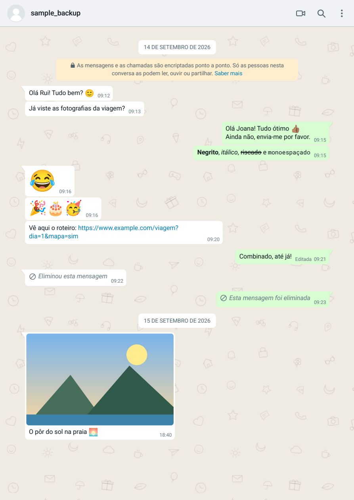
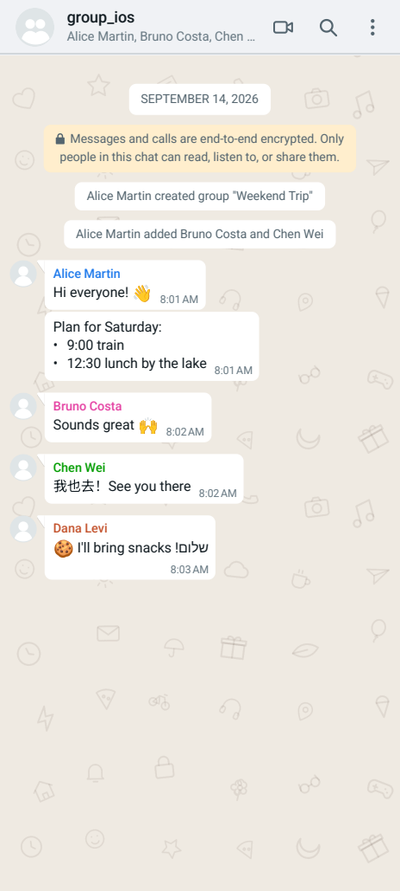
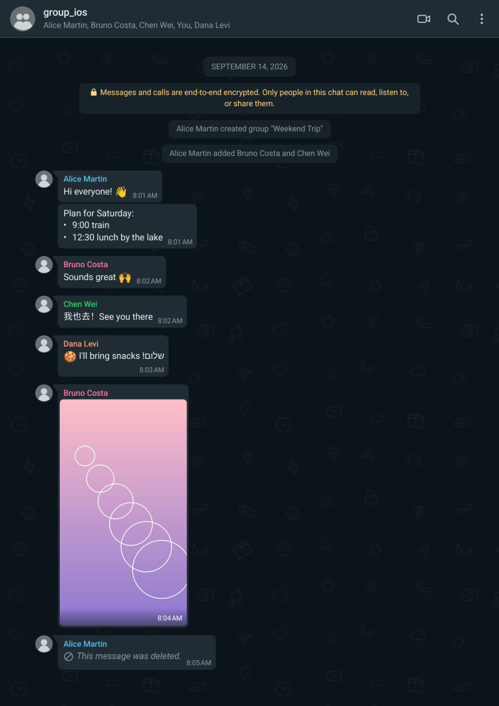

# wa-export-pdf

Convert a WhatsApp chat export (folder, `.txt` or `.zip`) into a **PDF that
looks like WhatsApp itself**: bubbles with tails, message grouping, date chips,
patterned wallpaper, photos, video frames, voice notes with waveforms,
documents with previews, stickers, contacts, locations, polls and system
messages.

Everything runs **locally and offline**. No data ever leaves your computer.

```bash
wa-export-pdf "/path/to/export" "/path/to/chat.pdf"
```

| A4 (WhatsApp Desktop layout) | iOS group, `--page-size phone` | `whatsapp-dark` theme |
|---|---|---|
|  |  |  |

Full sample PDF: [`examples/sample.pdf`](examples/sample.pdf).
The examples are generated from the fictitious fixtures in `tests/fixtures/`
(see [Visual validation](#visual-validation)).

---

## Contents

1. [Installation](#installation) — Fedora · Ubuntu/Debian · Windows · macOS
2. [Usage](#usage) and [CLI options](#cli-options)
3. [Export structure](#export-structure)
4. [What is reproduced](#what-is-reproduced)
5. [Limitations](#limitations)
6. [Troubleshooting](#troubleshooting)
7. [Architecture and technical decisions](#architecture-and-technical-decisions)
8. [Dependencies and licences](#dependencies-and-licences)
9. [Development and tests](#development-and-tests)

---

## Installation

Requirements: **Python 3.10+**. Chromium is downloaded and managed by
Playwright (once; this step needs Internet access). You never have to
configure a browser path. FFmpeg is **optional** (video frames and waveforms)
and can come from the system or from the `imageio-ffmpeg` package.

```bash
git clone https://github.com/dfelix/wa-export-pdf.git
```

### Fedora

```bash
sudo dnf install python3 python3-pip ffmpeg-free      # ffmpeg is optional
python3 -m venv ~/.venvs/wa-export-pdf
source ~/.venvs/wa-export-pdf/bin/activate
pip install "./wa-export-pdf[preview]"                 # or: pip install ./wa-export-pdf
python -m playwright install chromium
wa-export-pdf --check
```

If Chromium complains about missing libraries:
`sudo dnf install nss atk at-spi2-atk cups-libs libdrm libxkbcommon mesa-libgbm alsa-lib pango`.

### Ubuntu / Debian

```bash
sudo apt install python3 python3-venv ffmpeg
python3 -m venv ~/.venvs/wa-export-pdf && . ~/.venvs/wa-export-pdf/bin/activate
pip install "./wa-export-pdf[preview]"
python -m playwright install --with-deps chromium
```

### Windows (PowerShell)

```powershell
py -3 -m venv $env:USERPROFILE\venvs\wa-export-pdf
& $env:USERPROFILE\venvs\wa-export-pdf\Scripts\Activate.ps1
pip install ".\wa-export-pdf[all]"        # [all] includes a ready-to-use FFmpeg
python -m playwright install chromium
wa-export-pdf --check
```

Alternative FFmpeg: `winget install Gyan.FFmpeg` (it is added to `PATH`).

### macOS

```bash
brew install python ffmpeg              # ffmpeg is optional
python3 -m venv ~/.venvs/wa-export-pdf && source ~/.venvs/wa-export-pdf/bin/activate
pip install "./wa-export-pdf[preview]"
python -m playwright install chromium
wa-export-pdf --check
```

### Optional extras

| Extra       | Installs         | Purpose |
|-------------|------------------|---------|
| `[ffmpeg]`  | `imageio-ffmpeg` | FFmpeg binary for Windows/macOS/Linux without installing anything system-wide |
| `[preview]` | `pypdfium2`      | First-page previews of PDF documents; PNG screenshots in `--debug` |
| `[all]`     | both             | |

`wa-export-pdf --install-browser` is a shortcut for `python -m playwright install chromium`.

---

## Usage

```bash
# exported folder
wa-export-pdf ./backup ./chat.pdf

# .zip shared from the phone; phone-screen look; dark theme
wa-export-pdf "WhatsApp Chat with Ana.zip" ana.pdf --page-size phone --theme whatsapp-dark

# group chat: say who "me" is (messages on the right)
wa-export-pdf ./group group.pdf --me "Alex Doe"

# a date range only, without media
wa-export-pdf ./backup excerpt.pdf --from 2025-01-01 --to 2025-03-31 --no-media

# visual validation: HTML + JSON + PNG page renders
wa-export-pdf ./backup chat.pdf --debug --screenshots 20
```

**Who is "me"?** In a one-to-one chat exported as `WhatsApp Chat with Ana.txt`
(or the localised equivalents, e.g. `Conversa no WhatsApp com Ana.txt`), the
other participant is detected automatically. In groups (and iOS `_chat.txt`
exports) the export does not say who made it: use `--me "Name"`. Without it,
every message is shown as received and a warning is printed.

### CLI options

| Option | Description |
|---|---|
| `INPUT` | export folder, `.txt` file or `.zip` |
| `OUTPUT` | PDF to create (default: `<input name>.pdf` in the current folder) |
| `--theme NAME\|FOLDER` | `whatsapp` (light, default), `whatsapp-dark`, or a custom theme folder |
| `--page-size a4\|letter\|phone` | `a4`: WhatsApp Desktop layout on printable paper (default). `phone`: 412×915 px pages like an Android screen |
| `--background doodle\|plain` | patterned wallpaper (default) or plain colour |
| `--no-header` | do not draw the WhatsApp top bar on every page |
| `--ticks` | draw blue read ticks on sent messages (**cosmetic**: the export has no read status) |
| `--emoji-font bundled\|system` | bundled Noto Color Emoji (identical on every OS) or the system emoji font |
| `--title TEXT` | title shown in the top bar and the PDF metadata |
| `--css FILE` | extra CSS applied after the theme (repeatable) |
| `--me NAME` | your name exactly as it appears in the chat |
| `--from` / `--to YYYY-MM-DD` | date range |
| `--date-order auto\|dmy\|mdy\|ymd` | date format of the export (auto-detected) |
| `--lang pt\|pt-BR\|en\|es\|fr\|de\|it` | language of UI labels (auto-detected) |
| `--include-media` / `--no-media` | embed media (default) or show placeholders |
| `--quality low\|medium\|high\|original` | resolution of embedded pictures (720/1100/1600/unlimited px) |
| `--ffmpeg PATH` | FFmpeg executable (otherwise: `WA_EXPORT_PDF_FFMPEG`, `PATH`, `imageio-ffmpeg`) |
| `--no-waveform`, `--no-doc-preview` | skip waveforms / PDF previews |
| `-j, --jobs N` | parallel media workers |
| `--chunk-size N` | messages per Chromium pass (default 2000) |
| `--cache-dir FOLDER` | persistent thumbnail cache (fast re-runs; **stores derived images**) |
| `--keep-temp` | keep the temporary work folder |
| `--debug`, `--debug-dir FOLDER` | write `conversation.html`, `conversation.json` and `page-NNN.png` |
| `--screenshots N\|all` | pages to render in debug mode (default 10) |
| `--html-only` | only produce the HTML |
| `-v`, `-vv`, `-q` | more / less output |
| `--check` | check Chromium, FFmpeg, fonts and themes |
| `--install-browser` | download Playwright's Chromium |

---

## Export structure

In WhatsApp: *chat → ⋮ → More → Export chat → Include media*.
The result is a `.zip` (or a folder) such as:

```text
backup/
├── WhatsApp Chat with Ana.txt            (Android)   or   _chat.txt (iOS)
├── IMG-20260101-WA0001.jpg               photos
├── VID-20260101-WA0003.mp4               videos (also GIFs on Android)
├── PTT-20260101-WA0004.opus              voice notes
├── AUD-20260101-WA0005.m4a               audio files
├── STK-20260101-WA0006.webp              stickers
├── DOC-20260101-WA0007.pdf / Name.pdf    documents
├── Contact.vcf                           shared contacts
└── 00000012-PHOTO-2026-01-01-...jpg      (iOS names)
```

No file names are assumed: every file (including sub-folders) is indexed,
matched case-insensitively and with Unicode normalisation (macOS stores names
in NFD). Files without an extension are identified by their magic bytes.

Supported header formats (with separator variations, 2/4-digit years,
seconds, 12/24 h, `AM/PM`, `a.m.`, narrow no-break space U+202F):

```text
15/09/26, 10:32 - Name: text                    Android (pt, es, fr, de, it...)
9/15/26, 10:32 PM - Name: text                  Android (en-US)
2026-09-15 10:32 - Name: text                   Android (ISO)
[15/09/26, 10:32:05] Name: text                 iOS
```

Day/month order is detected from the values (> 12) and, when ambiguous, by
picking the order that produces the fewest jumps back in time.

---

## What is reproduced

| Element | Rendering |
|---|---|
| Bubbles | WhatsApp Web/Desktop colours, 7.5 px radius, subtle shadow, padding and typography |
| Grouping | the first message of a group has the tail and a square corner; the next ones sit 2 px apart; 12 px between groups |
| Time | bottom-right corner, sharing the last line of text when it fits (as WhatsApp does) |
| Dates | centred chip with the real date ("15 September 2026"); never "Today/Yesterday" |
| Text | `*bold*`, `_italic_`, `~strike~`, ```` ```mono``` ````, `` `code` ``, `> quote`, lists, clickable links, RTL |
| Emoji | bundled colour font; messages with only 1–3 emoji are shown large |
| Photos | inside the bubble, aspect ratio preserved, width/height limits, cropping of very tall/wide pictures, EXIF orientation |
| Videos / GIFs | representative frame, play or "GIF" badge, camera icon and duration |
| Voice notes | play button, real waveform computed from the audio, duration, avatar with microphone |
| Audio files | orange headphones icon, progress line and duration |
| Documents | icon per type, name, "N pages • PDF • 2.4 MB", first-page preview |
| Stickers | no bubble, transparency preserved, time in a small pill |
| Contacts | card with name/phone from the `.vcf` and a "Message" button |
| Locations | stylised generic map, coordinates and a link to the map |
| Polls | question, options, bars and vote counts (from the export) |
| Deleted / view-once / calls | icon plus the export's own text |
| System | centred chips; yellow encryption notice with a lock |
| Groups | per-participant name colours and default avatars |
| Replies / reactions | supported by the model and the renderer (only shown when data exists) |
| Page | WhatsApp top bar on every page, wallpaper in every margin |
| PDF | real searchable text, links, Month → Day bookmarks, JPEG images without re-compression |

### Pagination

* every message, date chip and system message has `break-inside: avoid`;
* date chips have `break-after: avoid` (never left alone at the bottom of a page);
* pictures are limited to less than a page in height;
* messages estimated to be taller than a page may start on the current page
  and continue on the next; `box-decoration-break: clone` keeps rounded
  corners on every fragment and the time stays at the end;
* `orphans`/`widows` = 2 in text.

### Why A4 by default (and `phone`)

* **A4/Letter**: printable, readable (~10.6 pt text), reproduces the WhatsApp
  Desktop/Web layout (wide panel, bubbles up to 65 %). About 14 text messages
  per page.
* **phone** (412×915 px, a typical Android viewport): every page looks like a
  phone screenshot. Great on screen; produces ~2.5× more pages and prints small.

---

## Limitations

These come from WhatsApp's export format, not from this tool:

* **Replies (quotes) and reactions are not in the exported `.txt`.** The model
  and the theme support them, but the parser cannot invent them.
* **Read status (ticks)**, "online/last seen", profile pictures and forwarded
  markers are not exported. Avatars are WhatsApp's generic icon; ticks only
  appear with `--ticks` (cosmetic).
* **Who "me" is** can only be inferred in one-to-one chats named after the contact.
* **View-once** media is not exported (the export's own text is shown, e.g.
  "File not revealed").
* Android exports **do not distinguish GIFs from videos** (both `VID-*.mp4`); iOS does.
* **Locations** only carry coordinates: the map is a generic illustration (no
  requests to map services).
* **HEIC** needs `pillow-heif` (not included); without it a placeholder is shown.
* **Without FFmpeg**: videos show a placeholder with play button and duration
  (read straight from the MP4); voice notes show their duration (read from the
  Ogg file) but a flat waveform.
* **Non-Latin text fonts** (CJK, Arabic, Hebrew, Devanagari...) come from the
  system (Windows and macOS ship them; on Linux install
  `google-noto-sans-cjk-fonts` / `fonts-noto-cjk`, `google-noto-sans-arabic-fonts`, etc.).
* Emoji in the **top bar** (contact name) use the system emoji font.
* With `--background doodle` the pattern has a slight discontinuity in the 8 px
  strip under the top bar and in the bottom margin.
* WhatsApp's UI differs between Android, iOS and Desktop: the base theme
  follows **WhatsApp Web/Desktop**; create a theme for another style (see below).

---

## Troubleshooting

| Symptom | Fix |
|---|---|
| `Chromium for Playwright is not installed` | `python -m playwright install chromium` (once, with Internet) |
| Chromium does not start on Linux (libraries) | `python -m playwright install-deps chromium` or the packages listed under [Fedora](#fedora) |
| Videos without a picture, voice notes without waveform | install FFmpeg or `pip install imageio-ffmpeg`; check with `wa-export-pdf --check` |
| Everything is on the left | `--me "Your Name"` (exactly as in the chat) |
| Day and month swapped | `--date-order dmy` or `mdy` |
| Chinese/Arabic characters shown as boxes | install Noto fonts for that script (Linux) |
| PDF too large | `--quality low`, or `--no-media` |
| Slow re-runs on big exports | `--cache-dir ./cache` (remember it stores private thumbnails) |
| Low memory | `--chunk-size 1000` |
| Want to inspect the HTML/CSS | `--debug` and open `conversation.html` in a browser |

Measured performance (Fedora, 8 threads): a real chat with 32,468 messages and
2,279 attachments (5 GB) → 2,292 A4 pages in 132 s, ~1 GB peak RAM.

---

## Architecture and technical decisions

```text
export (folder/.txt/.zip)
   │  parser/discovery.py   finds the .txt, extracts .zip safely
   ▼
parser/whatsapp.py + formats.py      (tolerant, two passes)
   ▼
models/message.py   Conversation / Message / Media / Reply / Reaction / Poll ...
   │
   ├── media/resolver.py   file index, magic bytes
   ├── media/processor.py  parallel + cache: images.py, video.py, audio.py,
   │                       documents.py, containers.py (durations without FFmpeg)
   ▼
renderer/html.py   visual decisions (groups, tails, sizes, dates) + Jinja
renderer/templates/*.html   +   themes/<theme>/*.css
   ▼
pdf/chromium.py    Playwright/Chromium: page.pdf() per chunk of days
pdf/merge.py       pypdf: joins chunks, Month → Day bookmarks, metadata
   ▼
chat.pdf
```

The renderer only knows the model; the parser knows nothing about HTML. A
future data source (e.g. the `msgstore.db` database, which has replies and
reactions) can feed the same renderer.

### Technology comparison

| Criterion | A: Python + ReportLab | **B: Python + HTML/CSS + Playwright** | C: Node + HTML/CSS + Playwright | D: WeasyPrint / Typst / LaTeX |
|---|---|---|---|---|
| Visual fidelity | low: every shape drawn by hand, no flexbox | **highest: WhatsApp Web's engine is a browser** | highest | medium: partial CSS (WeasyPrint lacks full flexbox, limited colour emoji); Typst/LaTeX far from the web look |
| PDF quality | good | **real text, font subsets, vectors, links, bookmarks** | same as B | good |
| Unicode / RTL / CJK | manual (limited shaping) | **Chromium's HarfBuzz + bidi + font fallback** | same | good (WeasyPrint) |
| Colour emoji | hard (images) | **native vector COLRv1** | same | limited |
| CSS / pagination | n/a | `break-*`, `box-decoration-break`, `@page` | same | good paged-media support |
| Images | ok | JPEG passthrough, `object-fit` | same | ok |
| Performance | fast | ~4 s per 2000 messages | same | slow on large documents |
| Cross-platform | yes | **yes (Chromium managed by Playwright)** | yes | WeasyPrint needs Pango/GTK on Windows |
| Installation | pip | pip + one command for the browser | npm + browser; Python still useful for media | varies |
| Maintenance | lots of layout code | **theme = editable CSS** | same as B | medium |

**Choice: B.** Visual fidelity is the main criterion and only a browser engine
reproduces WhatsApp's UI (which *is* HTML/CSS in its Web version). Between B
and C, Python has the better media-processing ecosystem (Pillow, pypdf,
pypdfium2) and Playwright for Python is on par with Node's.

Decisions verified experimentally during development:

* **Static fonts, not variable ones**: Chromium embeds variable fonts as
  Type 3; static Roboto instances are embedded as TrueType (better text
  selection and viewer compatibility).
* **Wallpaper as a PNG tile**: an SVG `background-image` is rasterised by
  Chromium at 72 dpi *per page* (≈66 KB per page, blurry); a 3× PNG tile is
  embedded once and reused as a tiling pattern — sharp and ~0 KB per page.
* **Shadows with blur ≤ 0.5 px** are not rasterised (they stay vector).
* **Top bar** via Chromium's `headerTemplate` (the only way to paint every
  page's margin); its font is passed as a data URI and preloaded in the main
  document, because the template cannot load files.
* **Chunks of ~2000 messages** cut at day boundaries: bounded memory for
  100,000+ message chats; the merge rebuilds the bookmarks.
* **Bundled emoji font** (Noto Color Emoji COLRv1): identical output on
  Windows/macOS/Linux, vector in the PDF.

### Themes

```text
src/wa_export_pdf/themes/
├── whatsapp/            theme.json, variables.css, base.css, bubbles.css,
│                        messages.css, media.css, dates.css, system.css,
│                        header.css, assets/doodle.{svg,png}
└── whatsapp-dark/       theme.json ("extends": "whatsapp"), variables.css
```

A custom theme is a folder with a `theme.json`:

```json
{ "name": "My theme", "extends": "whatsapp",
  "stylesheets": ["variables.css"], "header_stylesheets": ["variables.css"] }
```

and a `variables.css` with the tokens to change (`--bubble-out`, `--chat-bg`,
`--date-transform: none`, ...). Use `--theme ./my-theme`. A theme may also
have a `templates/` folder to override Jinja templates.

---

## Dependencies and licences

| Dependency | Why | Licence | Platforms | Internet | External binary |
|---|---|---|---|---|---|
| playwright | drives Chromium (HTML → PDF) | Apache-2.0 | Win/macOS/Linux | only for `playwright install chromium` | Chromium (downloaded by Playwright, BSD) |
| jinja2 | HTML templates with auto-escaping | BSD-3 | all | no | no |
| pillow | thumbnails, EXIF, WebP/PNG/GIF, corrupted images | MIT-CMU (HPND) | all | no | no |
| pypdf | merging chunks, bookmarks, page counts | BSD-3 | all (pure Python) | no | no |
| imageio-ffmpeg *(optional)* | ready-to-use FFmpeg | BSD-2 (the FFmpeg binary is LGPL/GPL) | Win/macOS/Linux | no | bundles ffmpeg |
| pypdfium2 *(optional)* | PDF previews, debug screenshots | Apache-2.0 / BSD-3 | Win/macOS/Linux | no | bundles PDFium |
| system FFmpeg *(optional)* | video frames, waveforms | LGPL/GPL | all | no | yes |
| pytest *(dev)* | tests | MIT | all | no | no |

Bundled files (see `THIRD_PARTY_NOTICES.md`):

* **Roboto** and **Roboto Mono** (static instances generated from the variable
  font) — SIL Open Font License 1.1.
* **Noto Color Emoji** (COLRv1) — SIL Open Font License 1.1. The OFL allows the
  font to be bundled and redistributed with software and subsets to be embedded
  in generated PDFs; it may not be sold by itself, and modified versions may
  not use the Reserved Font Name. Licence files are in `src/wa_export_pdf/fonts/`.
* SVG icons, wallpaper pattern and generic map: drawn for this project (MIT).
  WhatsApp's own assets (its wallpaper, emoji set, logo) are proprietary and
  are **not** included. "WhatsApp" is a trademark of Meta Platforms, Inc.; this
  project is not affiliated with or endorsed by Meta.

---

## Development and tests

```bash
python -m venv .venv && . .venv/bin/activate        # Windows: .venv\Scripts\activate
pip install -e ".[all,dev]"
python -m playwright install chromium
pytest                    # 86 tests; PDF tests are skipped if Chromium is missing
```

* `tests/test_parser.py` — simple, multi-line, Unicode, emoji, accented names,
  7 timestamp formats, ambiguous date order, system messages, iOS,
  attachments, omitted/deleted/edited messages, locations, polls, malformed
  lines, encodings, CRLF/BOM, `.zip`.
* `tests/test_media.py` — JPEG, PNG, WEBP, EXIF, huge and corrupted images,
  transparent stickers, cache, MP4/Ogg durations without FFmpeg, video, audio,
  waveform, PDF, vCard, unknown and missing files.
* `tests/test_renderer.py` — formatting, HTML escaping, links, emoji, groups,
  date chips, names, replies/reactions, nothing invented, themes, chunks.
* `tests/test_pdf.py` — PDF created, searchable text, links, bookmarks, real
  images, CLI with debug/phone/dark, `--no-media`, chunk merging.

Fixtures (all fictitious): `tests/fixtures/sample_backup/` (Android, Portuguese,
every message type) and `tests/fixtures/group_ios/` (iOS group, English, 12 h).
Regenerate the binaries with `python tests/fixtures/make_fixtures.py` and the
wallpaper with `python tools/make_doodle.py`.

CI (`.github/workflows/ci.yml`) runs the tests on Ubuntu, Windows and macOS and
uploads the rendered sample for visual comparison.

### Visual validation

```bash
wa-export-pdf tests/fixtures/sample_backup out/sample.pdf --me "Rui Costa" --debug --screenshots all
```

creates `out/sample-debug/` with `conversation.html` (open it in a browser and
compare side by side with WhatsApp Web), `conversation.json` (parse
statistics) and `page-001.png`, `page-002.png`, ... rendered **from the PDF**
(with `pypdfium2`; without it, screenshots of the HTML).

> Privacy: the debug folder and `--cache-dir` contain thumbnails of the chat's
> pictures. By default everything derived lives in a temporary folder that is
> deleted at the end.

## License

MIT — see `LICENSE`. Bundled fonts: OFL-1.1 (see `THIRD_PARTY_NOTICES.md`).
